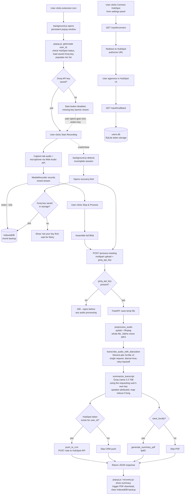

# Meeting Summarizer & CRM Sync — Architecture & System Workflow

## 1. System Overview

**Meeting Summarizer & CRM Sync** is a two-tier application that records audio from a browser meeting tab (Google Meet, Zoom, etc.), transcribes it, summarizes it with an LLM, and optionally pushes the summary into a user's HubSpot CRM as a Note and/or exports it as a local PDF.

The system is composed of two independently deployable parts:

- **A Chrome Extension (Manifest V3)** — the client. Captures tab + microphone audio in the browser, manages recording state, persists in-progress audio for crash recovery, uploads the finished recording to a backend, and (via a settings panel) collects per-user configuration: HubSpot connection, a "save as PDF" preference, and the user's own required Groq API key.
- **A Python FastAPI backend** (single-file, `main.py`) — the server. Receives the uploaded audio, orchestrates a multi-stage processing pipeline (chunk → transcribe → summarize → push to CRM → optional PDF), and manages per-user HubSpot OAuth credentials.

**Architectural pattern:** This is a **client-server / modular monolith** hybrid:
- The extension itself follows an **event-driven** pattern (Chrome extension lifecycle events, `MediaRecorder` events, message-passing between extension contexts).
- The backend is a **modular monolith with a linear processing pipeline** (a single FastAPI service organized into clearly separated numbered "steps," rather than separate microservices), fronted by one primary REST endpoint (`/process-meeting`) plus a set of OAuth-related endpoints.

**Transcription architecture:** audio is no longer split into independent chunks for transcription. ElevenLabs Scribe v2 diarization (`speaker_id` values) is only consistent *within a single request*, so the whole (downsampled/compressed) recording is sent to ElevenLabs as one request with `diarize=true`, and the resulting word-level output is reshaped into speaker turns and a timestamped, speaker-labeled transcript. The map-reduce step used for long-meeting summarization still splits the transcript into sections, but only along turn boundaries, so speaker/timestamp attribution is never broken mid-line.

There is no shared database between client and server beyond what's passed over HTTP — the extension holds transient recording state in `chrome.storage.local` and `IndexedDB`; the backend holds only per-user HubSpot tokens in a local SQLite file (`users.db`). The backend does not persist recordings, transcripts, or summaries — everything downstream of a single request is stateless and discarded after the response is returned.

**Summarization credentials:** there is no shared/server-side Groq key. Every user supplies their own Groq API key via the extension's settings panel; it's sent with each `/process-meeting` request and used for that request's summarization call(s) only — never stored server-side, never persisted beyond the request. A request with no key is rejected outright (`400`) before any audio processing starts.

---

## 2. End-to-End System Workflow

### Step-by-step flow

1. **User clicks the extension toolbar icon.** `background.js` opens a persistent popup window (not the default MV3 popup, since that auto-closes when the OS microphone permission dialog steals focus).
2. **`popup.js` initializes**: generates/retrieves a persistent `user_id` (UUID, stored in `chrome.storage.local`), checks HubSpot connection status via `GET /oauth/status`, loads the user's saved Groq API key (if any) into the settings panel, populates the microphone dropdown, and checks for any unfinished prior session to offer recovery.
3. **Settings panel (gear icon in the header).** Clicking it opens a slide-in panel with three things: HubSpot connect status/button, the "save as PDF" checkbox, and a required Groq API key field. The key is auto-saved to `chrome.storage.local` (debounced) as the user types. **The "Start recording" button stays disabled, and a warning banner is shown, until a Groq key is present** — there is no shared/fallback key, so recording an entire meeting only to fail at the summarization step is avoided by gating at the UI level.
4. **User clicks "Start recording"** (only enabled once a Groq key is set). The extension captures tab audio (`chrome.tabCapture`) and microphone audio (`getUserMedia`), mixes both streams via the Web Audio API into one `MediaStream`, and starts a `MediaRecorder` (`audio/webm;codecs=opus`).
5. **During recording:** audio chunks are collected in memory and also periodically flushed to **IndexedDB** (every ~10s of audio) via `session-utils.js`, so a crash or accidental window close loses at most a few seconds of audio, not the whole meeting.
6. **User clicks "Stop & process."** The recorder stops, remaining unflushed audio is written to IndexedDB, and the full recording (all chunks) is assembled into one `Blob` and uploaded via `fetch()` as `multipart/form-data` to the backend's `POST /process-meeting` endpoint — including the user's Groq API key from `chrome.storage.local` as a form field.
7. **Backend receives the upload.** It first validates that `groq_api_key` is present and non-blank, rejecting with `400` immediately if not (before writing any temp file or touching audio). Otherwise it writes the upload to a temp file and runs it through the processing pipeline:
   - **Preprocessing (`preprocess_audio`)** — pydub/ffmpeg downsamples the whole recording to 16kHz mono and re-exports it as a single compressed MP3 (32kbps). Unlike the old pipeline, audio is **no longer split into chunks** for transcription — see the diarization note below.
   - **Diarized transcription (`transcribe_audio_with_diarization`)** — the entire preprocessed file is POSTed to ElevenLabs' Scribe v2 endpoint **in one request** with `diarize=true`, word-level timestamps, and audio-event tagging. This is a deliberate change from the old per-chunk approach: ElevenLabs' `speaker_id` values (`speaker_0`, `speaker_1`, ...) are only consistent *within a single request*, so transcribing pieces separately would produce unrelated "Speaker 1" labels that don't refer to the same person across chunks. The request retries up to 3 times (5s/10s backoff) using a single generous timeout (`ELEVENLABS_TIMEOUT = 1800.0`) applied uniformly to connect/write/read, to avoid a known `requests`/urllib3 quirk where a tuple timeout can kill a large upload's write phase prematurely. The word-level response is collapsed into speaker turns and formatted as a timestamped, speaker-labeled transcript (`[HH:MM:SS] Speaker N: ...`).
   - **Summarization (`summarize_transcript`)** — the diarized transcript is sent to Groq's Llama 3.3 70B model (via `langchain-groq`), authenticated with the **requesting user's own Groq API key** (never a server-side key). Short transcripts go through in a single call; long transcripts (>3,000 words) are split into ~2,200-word sections **without ever breaking a `[HH:MM:SS] Speaker N: ...` line in half** (to preserve speaker/timestamp attribution), summarized individually (map step), then combined into one final structured summary (reduce step). Prompts explicitly instruct the model to attribute points to specific speakers wherever the transcript supports it.
   - **CRM push (`push_to_crm`)** — if the requesting `user_id` has a connected HubSpot account (OAuth token in `users.db`), the structured summary is posted to HubSpot as a CRM Note. If not connected, this step is skipped without failing the request.
   - **PDF export (`generate_summary_pdf`)** — if `save_locally=true` was passed, the summary is rendered into a PDF (via `fpdf2`) and returned as base64 in the response, for the extension to save via `chrome.downloads`.
8. **Backend returns a JSON response** containing the meeting title, a structured transcript object (formatted text, plain text, per-speaker turns with timestamps, detected speaker count, and language code), the summary, CRM push result, and (optionally) the base64 PDF.
9. **Extension receives the response**, displays the summary in the popup, triggers the local PDF download if applicable, and clears the IndexedDB backup for that session (since it's no longer needed).
10. **Crash/interruption recovery path:** if the popup window closes before step 9 completes (crash, accidental close, browser hiccup), `background.js` detects the incomplete session (tracked via `chrome.storage.local`) and opens `recovery.html`, which re-reads the saved audio from IndexedDB and re-runs the same upload-and-process flow (`recovery.js`, sharing `uploadRecording()` from `session-utils.js`). `recovery.js` also reads the saved Groq key from `chrome.storage.local`; if none is set, it stops and tells the user to set one in the popup's settings panel before retrying, rather than firing an upload that the backend would reject anyway.

### Separate flow: HubSpot OAuth connection

1. User clicks "Connect HubSpot" in the popup → opens `GET /oauth/connect?user_id=...` in a new tab.
2. Backend redirects to HubSpot's authorization URL (data-center-specific subdomain), with `user_id` embedded in the `state` parameter.
3. User approves access in HubSpot's UI → HubSpot redirects back to `GET /oauth/callback?code=...&state=...`.
4. Backend exchanges the code for an access/refresh token pair and saves it in `users.db`, keyed by `user_id`.
5. On future requests, `get_valid_access_token()` transparently refreshes the token if expired, using the stored refresh token.

### Mermaid diagram

---

## 3. Libraries & Dependencies Analysis

| Library / Package | Category / Type | Specific Purpose in This Project | Why It's Used |
| :--- | :--- | :--- | :--- |
| `fastapi` | Web framework | Defines the backend's HTTP API (`/process-meeting`, `/oauth/*`, `/health`) | Async-capable, type-hint-driven request validation, minimal boilerplate for a single-file service |
| `uvicorn` | ASGI server | Runs the FastAPI app (`uvicorn.run(app, ...)`) | Standard production-grade ASGI server for FastAPI |
| `pydub` | Audio processing | Loads the uploaded recording, downsamples to 16kHz mono, and exports the whole file as one compressed MP3 (32kbps) — no chunking, so ElevenLabs diarization stays consistent across the recording | Simplifies audio manipulation via a Pythonic API over ffmpeg |
| `requests` | HTTP client | All outbound calls to ElevenLabs, HubSpot's OAuth/CRM APIs, and (in test scripts) httpbin.org | Synchronous, well-understood HTTP client with fine-grained timeout control (connect/read tuples) |
| `python-dotenv` | Configuration | Loads `ELEVENLABS_API_KEY`, `HUBSPOT_CLIENT_ID`, `HUBSPOT_CLIENT_SECRET`, etc. from a `.env` file. Groq is deliberately **not** loaded from `.env` — there is no server-side Groq key; each request supplies its own via the `groq_api_key` form field. | Keeps secrets out of source code |
| `langchain-groq` | LLM integration | Wraps the Groq Llama 3.3 70B chat model (`ChatGroq`) for the summarization step | Provides a consistent message-based interface (`SystemMessage`/`HumanMessage`) over Groq's API |
| `groq` (SDK) | LLM client | Used directly in `test_groq.py` for isolated connectivity testing | Lower-level access to the Groq API for debugging outside the LangChain wrapper |
| `fpdf2` (`fpdf`) | PDF generation | Renders the meeting title + structured summary into a downloadable PDF (`generate_summary_pdf`) | Lightweight, dependency-free PDF creation without a headless browser |
| `pydantic` | Data validation | Defines the `CrmPushResult` response model | Type-safe request/response schemas, integrates natively with FastAPI |
| `sqlite3` (stdlib) | Local database | Stores per-user HubSpot OAuth tokens (`users.db`) | Zero-setup embedded database, sufficient for single-machine token storage |
| `secrets` (stdlib) | Security | Generates a random nonce for the OAuth `state` parameter | Cryptographically secure randomness, mitigates CSRF on the OAuth flow |
| `tempfile` (stdlib) | File handling | Creates temp files/directories for uploaded audio and chunked output | Ensures per-request working files are isolated and easy to clean up |
| `logging` (stdlib) | Observability | Structured log output across every pipeline stage | Debuggability for a pipeline with multiple external API dependencies |
| **Chrome Extension APIs** | Browser platform | `chrome.tabCapture`, `chrome.storage.local`, `chrome.windows`, `chrome.downloads`, `chrome.runtime` | Native browser APIs required for tab audio capture, persistent extension state, and file downloads — no external JS libraries are used in the extension |
| **IndexedDB** (browser built-in) | Client-side storage | Persists audio chunks during recording for crash recovery (`session-utils.js`) | Only browser storage mechanism capable of holding large binary blobs across a session |
| **Web Audio API** (browser built-in) | Audio processing | `AudioContext`, `createMediaStreamSource`, `createMediaStreamDestination` — mixes tab + mic audio into one stream | Native, dependency-free way to combine two live audio sources in-browser |

---

## 4. Core Modules & Component Architecture

### Backend (`backend/main.py`) — single-file FastAPI service, organized into numbered steps

| Module/Section | Responsibility |
| :--- | :--- |
| **Config** | Loads environment variables, sets up logging, CORS, and global constants (chunk length, model names, timeouts). |
| **Step 0 — Token storage** (`init_db`, `save_tokens`, `get_tokens`, `get_valid_access_token`) | SQLite-backed persistence for per-user HubSpot OAuth tokens, including transparent refresh-token renewal. |
| **Step 0b — OAuth endpoints** (`/oauth/connect`, `/oauth/callback`, `/oauth/status`) | Drives the three-legged OAuth flow: redirect to HubSpot, receive the authorization code, exchange it for tokens, and expose a status check for the extension UI. |
| **Step 1 — Audio preprocessing** (`preprocess_audio`) | Converts the raw uploaded audio into one downsampled, compressed, transcription-ready file (16kHz mono MP3, 32kbps) — the whole recording, not chunks. |
| **Step 2 — Diarized transcription** (`transcribe_audio_with_diarization`, `_build_speaker_turns`, `ELEVENLABS_TIMEOUT`) | Sends the entire file to ElevenLabs Scribe v2 in one request with `diarize=true` and word-level timestamps (retry/backoff, single generous timeout), then collapses the word-level output into speaker turns and a formatted, timestamped, speaker-labeled transcript. |
| **Step 3 — Summarization** (`summarize_transcript`, `_split_into_sections`, `_get_summary_llm`) | Produces structured meeting notes via Groq Llama 3.3 70B, authenticated with the requesting user's own Groq API key (no server-side fallback), using a map-reduce strategy for long transcripts. |
| **Step 3.5 — PDF export** (`generate_summary_pdf`, `sanitize_filename`) | Optional, user-triggered rendering of the summary into a downloadable PDF; never persisted server-side. |
| **Step 4 — CRM push** (`push_to_crm`) | Posts the summary as a HubSpot CRM Note using the requesting user's stored OAuth token; degrades gracefully (skips) if not connected. |
| **API endpoint** (`/process-meeting`, `/health`) | Validates `groq_api_key` is present (rejects with `400` before any processing if not), then orchestrates steps 1–4 in sequence for a single request; `/health` reports configuration status (ElevenLabs/HubSpot keys set server-side; Groq is reported as "per-user" since it's never held server-side) without exposing secrets. |

### Extension (`extension/`)

| File | Responsibility |
| :--- | :--- |
| `manifest.json` | MV3 manifest declaring permissions (`tabCapture`, `storage`, `downloads`, etc.) and registering `background.js` as the service worker. |
| `background.js` | Persistent (event-driven) service worker. Opens the recorder popup window on icon click, tracks recording/session state in `chrome.storage.local`, updates the toolbar badge, and triggers crash recovery by opening `recovery.html` when a window closes mid-session. |
| `popup.html` / `popup.js` | The main recording UI: mic selection, timer, start/stop controls, and result display, plus a gear-icon **settings panel** (HubSpot connect status/button, "save as PDF" toggle, and the required Groq API key field, auto-saved to `chrome.storage.local`). The Start button stays disabled and a warning banner shows until a Groq key is present. Owns the actual `MediaRecorder` capture logic. |
| `recovery.html` / `recovery.js` | A minimal UI shown only after an interrupted session is detected. Re-reads unfinished audio from IndexedDB, reads the saved Groq key from `chrome.storage.local` (prompting the user to set one via the popup if missing), and re-runs the same upload pipeline as `popup.js`. |
| `session-utils.js` | Shared utility module (loaded by both `popup.html` and `recovery.html`) providing: IndexedDB chunk read/write/delete functions, and the single `uploadRecording()` function used by both normal completion and recovery flows — including forwarding the user's Groq API key as a form field — ensuring both paths hit the backend identically. |

### Interaction pattern

- `background.js` is the only long-lived component; it coordinates window lifecycle and crash detection but does **not** touch audio directly.
- `popup.js` and `recovery.js` are two independent entry points into the **same** upload/processing logic (`uploadRecording`), which prevents drift between the "happy path" and "recovery path."
- The backend has **no knowledge of the extension's internal recording state** — it only ever sees a finished audio file per request, keeping the client/server boundary clean.

---

## 5. Data Flow & Execution Sequence

### Request/response cycle for `POST /process-meeting`

1. **Input:** `multipart/form-data` containing `file` (audio blob), `user_id` (string), `save_locally` (boolean), `groq_api_key` (string, required).
2. **Key validation (before any I/O):** `groq_api_key` is stripped and checked first; a missing/blank value is rejected immediately with `400`, before the temp file write or any audio work. Only after that does the upload get streamed to a `NamedTemporaryFile` on disk; an empty file is rejected immediately (`400`) too.
3. **Preprocessing (synchronous, local compute):** `preprocess_audio()` shells out to ffmpeg via pydub — no network call. Produces one downsampled/compressed MP3 in a fresh temp directory (no chunk files).
4. **Diarized transcription (single external API call, retried):** `transcribe_audio_with_diarization()` sends the whole preprocessed file to ElevenLabs in one request (`diarize=true`), with up to 3 attempts (5s/10s backoff) against transient failures. On success, word-level output is collapsed into speaker turns and a formatted transcript. If the request never succeeds, or if it succeeds but produces no usable text, the endpoint returns `422`/`500` with the underlying error(s) — there's no partial-chunk fallback since it's a single request for the whole recording.
5. **Summarization (external API call(s)):** `summarize_transcript()` makes either one or several sequential calls to Groq depending on transcript length (word-count threshold of 3,000 triggers map-reduce), authenticated with the requesting user's own Groq API key from the request — never a server-side key. Each call is a blocking `llm.invoke()`.
6. **Title extraction:** a regex (`extract_meeting_title`) pulls the "Meeting Title:" line out of the structured summary text — pure in-memory string processing, no I/O.
7. **CRM push (external API call, conditional):** `push_to_crm()` looks up the user's token (refreshing if expired via a call to HubSpot's token endpoint), then POSTs a Note object to HubSpot's CRM API. Failure here is caught and reported in the response (`status: "failed"`) rather than raising — the rest of the pipeline's output is still returned to the user.
8. **PDF generation (conditional, local compute):** only runs if `save_locally=true`; failure is caught and reported inline (`pdf.error`) without failing the whole request.
9. **Response assembly:** all stage outputs (`meeting_title`, `transcript`, `summary`, `crm_push`, `pdf`) are combined into one JSON object and returned with `200`.
10. **Cleanup (`finally` block):** the temp input file and the entire chunk directory are deleted regardless of success or failure, so no audio or intermediate files persist on the server after the request completes.

### State changes and side effects

- **Persistent state changed by this endpoint:** none directly (HubSpot's own CRM data changes as a side effect of the push, but nothing is written to `users.db` during `/process-meeting` itself — tokens are only *read*, and refreshed-in-place if expired). The submitted `groq_api_key` is used in-memory for the duration of the request only (passed straight into the `ChatGroq` client) and is never written to disk, logged, or stored anywhere server-side.
- **Persistent state changed by the OAuth endpoints:** `users.db` gains/updates one row per successful `/oauth/callback`.
- **Client-side state changes per recording:** IndexedDB gains chunk rows during recording, and both are deleted (`deleteSessionFromDB`) only after a confirmed-successful upload — guaranteeing the backup outlives any failure that would otherwise lose the recording. Separately, `chrome.storage.local` holds the user's Groq API key (`userGroqApiKey`) once entered in settings — this persists across sessions/recordings so it only needs to be entered once per browser profile.

### Background/async behavior

- The backend endpoint itself is `async def` (FastAPI), but the actual pipeline steps (`preprocess_audio`, `transcribe_audio_with_diarization`, `summarize_transcript`, `push_to_crm`) are synchronous, blocking functions called sequentially within it — there is no background task queue or worker process; a single request occupies the handler for the full duration of the pipeline (audio processing + all external API round-trips).
- On the client, the only asynchronous/background behavior is the periodic IndexedDB flush during recording (`FLUSH_EVERY_N_CHUNKS = 10`), which runs opportunistically inside the `MediaRecorder.ondataavailable` handler without blocking the recording itself.
